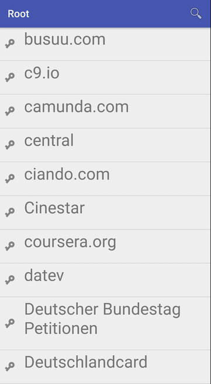
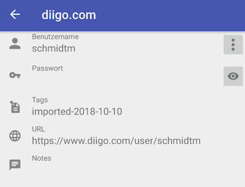

# Snorri
## Android browsing application for Loki password-files.

This application is an Android application to view a tree of loki password files.
See [Loki](https://github.com/ms140569/loki "loki") for details on those files, there structure
and encoding.

This is how Snorri looks like:

## Landingpage:

## Accountslist:

## Single record:

